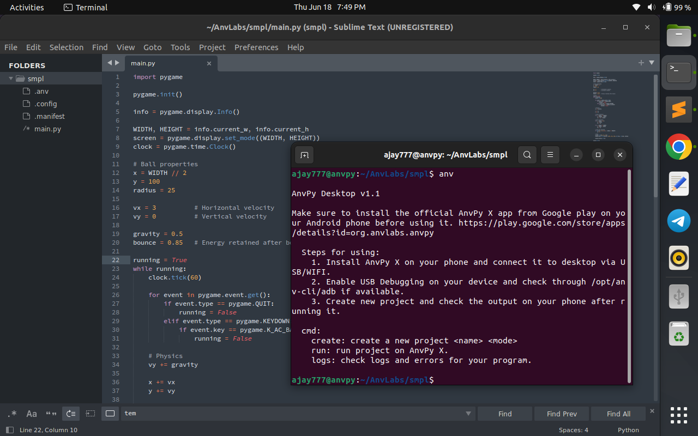

# anvpy-cli
anv-cli enables developers to run and debug AnvPy projects directly from their PC. Connect to the AnvPy app, view logs in real time, test changes instantly, and streamline your development workflow without being limited by a mobile screen.

# About AnvPy
[AnvPy](https://play.google.com/store/apps/details?id=org.anvlabs.anvpy) is a Python-powered Android IDE designed for building applications, games, and other software directly on Android devices. It includes an integrated Python interpreter, code editor, debugger, and project management tools, allowing developers to write, run, test, and debug code within a native Android environment.

AnvPy currently supports:

- Android Application Development
- 2D Game Development
- 3D Game Development through the [NovaX](https://github.com/aksahu-anvlabs/NovaX) Engine

The platform is actively maintained and regularly updated to support modern technologies, improve performance, and provide developers with the best possible development experience on Android.

## Contributing
There are several ways to contribute to the AnvPy ecosystem. At the moment, one of the most impactful areas is the ongoing development of the NovaX Engine, the next-generation 3D engine powering advanced game development within AnvPy.

Whether you're interested in engine development, rendering systems, tooling, documentation, testing, or bug fixing, contributions of all sizes are welcome.

## Binaries

Pre-built binaries for Windows, Linux, and macOS are available on the [Releases](../../releases) page.

## Community

Join the AnvPy community to connect with other developers, get support, share your projects, and stay updated with the latest news, releases, and announcements. 

+ [Discord](https://discord.gg/uGsxX59vE5)
+ [Telegram](https://t.me/+FrgEGaE8wC03YWE1)

## Support AnvPy

AnvPy is completely free and open for everyone. We believe powerful development tools should be accessible to all developers, regardless of their device or budget.

If AnvPy has helped you build applications, games, or learn programming, consider supporting its development. Your contribution helps us maintain the project, improve existing features, develop new technologies such as NovaX, and keep AnvPy free for the community.

### Ways to Support

- [Paypal](https://www.paypal.me/pythonforandroid)
- [RazorPay](https://razorpay.me/@vissora)

Every contribution, regardless of size, directly supports the continued growth of the AnvPy ecosystem.

❤️ Thank you for supporting independent software development.
